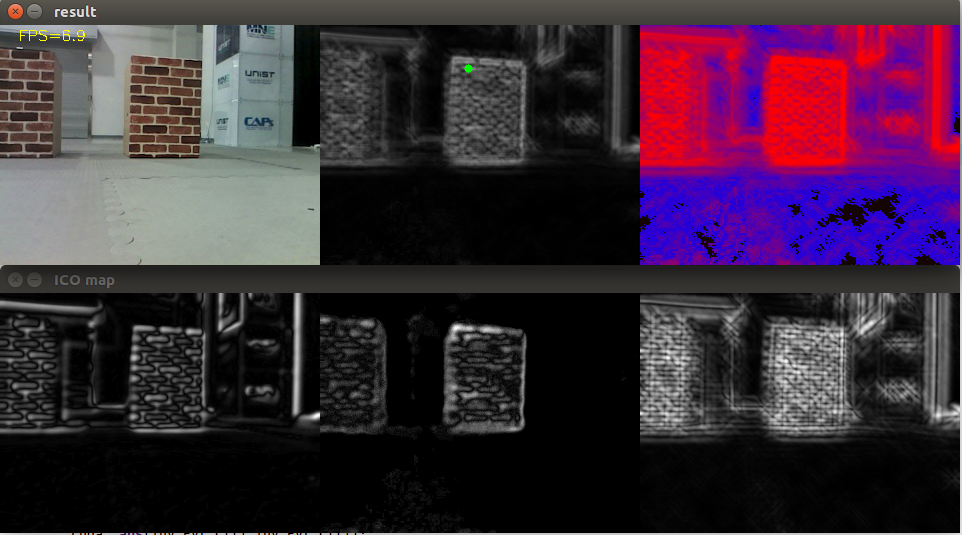
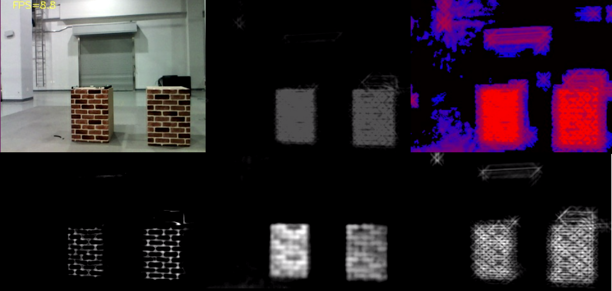
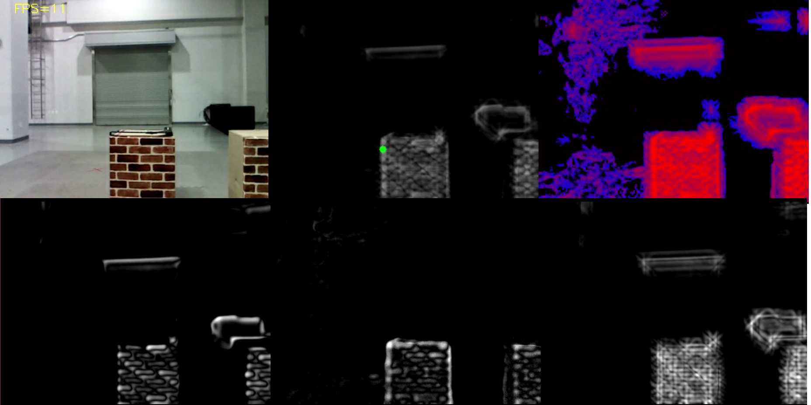

# Saliency_detection

Saliency detection based on color opponent, light intensity, orientation

1.OpenCV w/o CUDA(CPU only, 7Hz)

2.OpenCV w/ CUDA(GPU max, 8-9Hz)

3.Performance Optimization(CPU&GPU, 9-11Hz)

* Reference

Itti, L. et al. A model of saliency-based visual attention for rapid scene analysis. IEEE Trans. Patt. Anal. Mach. Intell. 20, 1254–1259 (1998).
