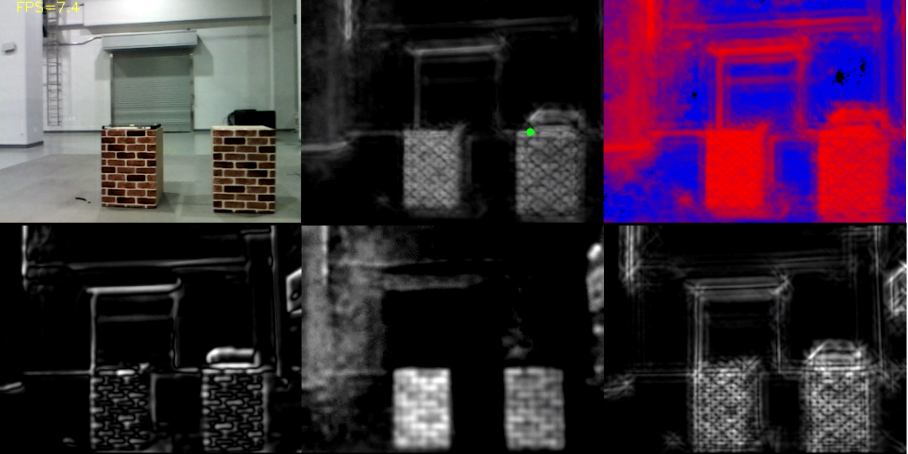

# Saliency_detection

Saliency detection based on color opponent, light intensity, orientation

1.OpenCV w/o CUDA

2.OpenCV w/ CUDA

* Reference

Itti, L. et al. A model of saliency-based visual attention for rapid scene analysis. IEEE Trans. Patt. Anal. Mach. Intell. 20, 1254–1259 (1998).
